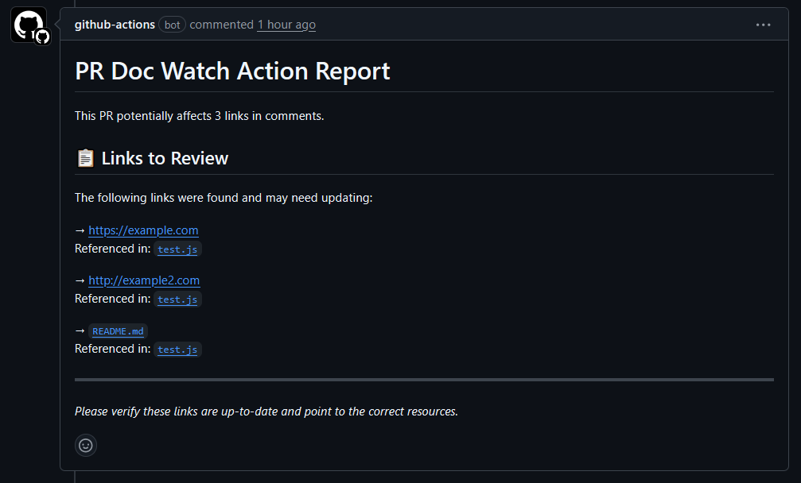

# Documentation Link Checker

A GitHub Action that scans pull request files for links in code comments.
Helps members on the team to always keep documentation up to date.

## Use case

I tend to link documentation (either markdown files or confluence) in code
comments in my code. This helps me reach documentation faster, but often gets
missed when other people update files that link to documentation. 

This action hopefully eliminates this headache, since you now get a tiny report
listing all links in the doc that you need to review as part of your change.

> [!WARNING]  
> This action is for pull-requests only. Using it in other types of workflows
> will fail. 

> [!NOTE]  
> I have the action configured to always exit with code 0, even in errors, to
> prevent it from stopping your workflows. I also recommend passing `continue-on-error`.

## Usage

In your pull request workflow file, add the following:

```yaml
jobs:
    steps:
      # ...
      - name: Check documentation links
        uses: kl13nt/pr-doc-watch-action@v1.0.0
        continue-on-error: true
        with:
          github-token: ${{ secrets.GITHUB_TOKEN }}
      # ...
```

## Inputs

| Input           | Description                    | Required | Default               |
| --------------- | ------------------------------ | -------- | --------------------- |
| `github-token`  | GitHub token for API access    | No       | `${{ github.token }}` |

## Supported Comment Styles

- `//` - C-style single line (JavaScript, Java, C++, Rust, Go)
- `/* */` - C-style multi-line
- `#` - Python, Ruby, Shell, YAML
- `<!-- -->` - HTML, XML
- `--` - SQL

## Example Output




## Contributing

This codebase and all data sources used as part of it are licensed under the GNU
General Public License v3.0 only. For more information about this please refer
to [choosealicense](https://choosealicense.com/licenses/gpl-3.0) and the
[official document](https://www.gnu.org/licenses/gpl-3.0.en.html).

Contributions are always welcome! Please always be respectful to there
contributors. That's all we ask of you. Feel free to contribute in code, merge
requests, issue help, and data collection.

We're open to all kinds of contributions. If you want to:

- 🤔 Suggest a feature
- 🐛 Report an issue
- 📖 Improve documentation
- 👩‍💻 Contribute to the code
- 📝 Contribute to the data

You are more than welcome. This repo follows a [code of
conduct](CODE_OF_CONDUCT.md).

If you'd like to contribute to code follow the [contributing
guidelines](CONTRIBUTING.md).

If you'd like to request a feature or submit general feedback please do so
either through the GitHub issues page. Please note that issues submitted
through the GitHub issues page will be required to adhere to the [contributing
guide](./CONTRIBUTING.md).

## Roadmap & ideas

- [ ] Validate absolute internet URLs (http, https) for error responses
- [ ] Option to ignore files (such as lock files)
- [ ] Verify linked files exist and/or are updated
- [ ] Template customisation
- [ ] Other git providers